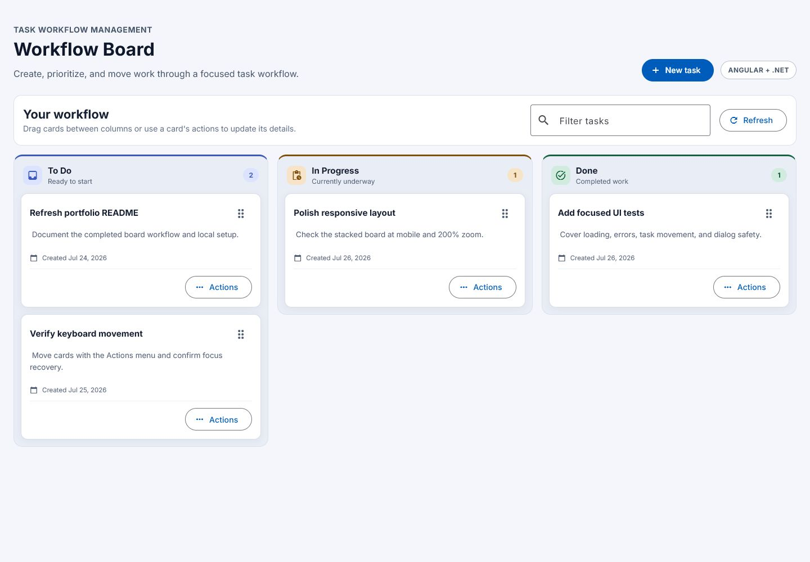
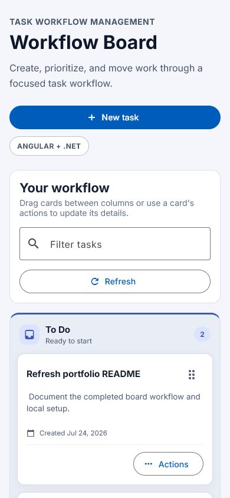
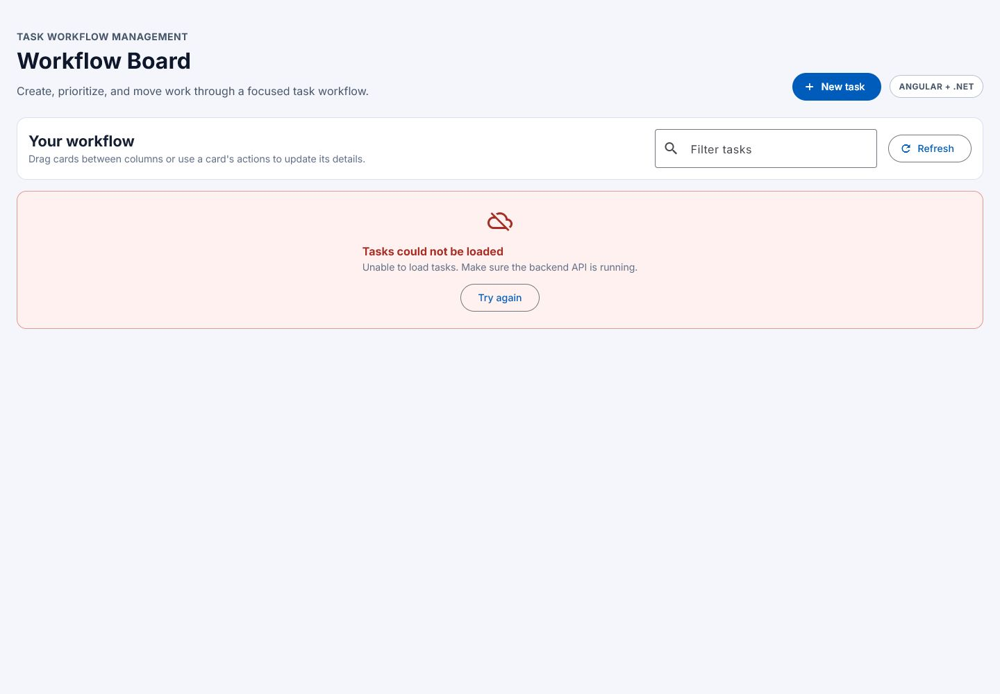
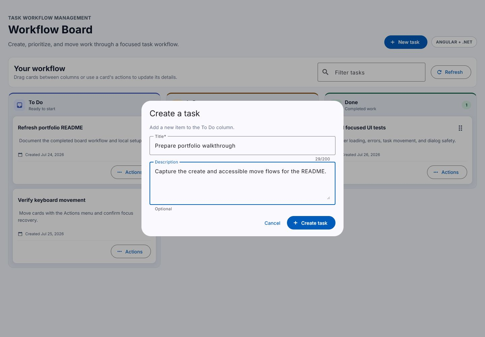
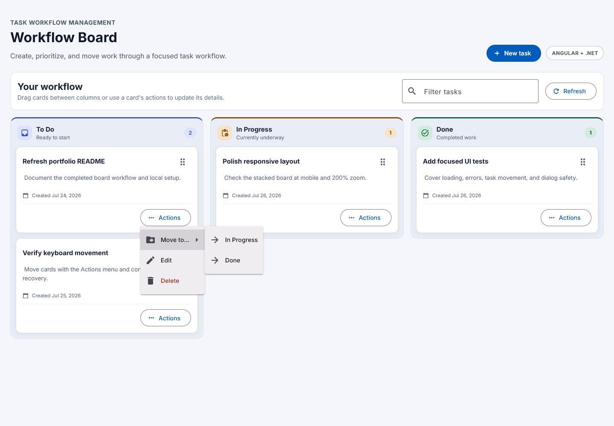

# TaskWorkFlowManagement

TaskWorkFlowManagement is a full stack portfolio project for managing tasks through a simple workflow. It demonstrates a practical ASP.NET Core Web API, PostgreSQL persistence with EF Core, and a modern Angular frontend.

## Application preview



The board keeps the same workflow at narrow widths by stacking columns, controls, and task cards into a single readable flow.

| Responsive board | Actionable API error |
| --- | --- |
|  |  |

Task creation and status movement remain available without relying on drag and drop.

| Dialog-based creation | Accessible status movement |
| --- | --- |
|  |  |

## Stack

- ASP.NET Core Web API
- Entity Framework Core
- PostgreSQL
- AutoMapper
- Swagger / OpenAPI
- Angular
- TypeScript
- Angular Material
- Angular CDK Drag & Drop

## Implemented features

- TaskItem create, read, update, and delete
- Soft delete for deleted tasks
- Status workflow: `ToDo`, `InProgress`, `Done`
- Kanban-style task board
- Drag and drop between status columns
- Accessible `Move to…` menu for keyboard-friendly status changes
- Dialog-based task creation and editing with validation and safe busy states
- Keyword filtering by title or description
- Responsive three-column board that stacks below 960px
- Loading, retry, empty, filtered-empty, and mutation feedback states
- Focus recovery and polite announcements after status changes
- Focused Angular behavior tests using typed service doubles

## Local setup

### Backend

Configure the PostgreSQL connection string with ASP.NET Core configuration. For local development, use an environment variable or user secrets:

```bash
ConnectionStrings__DefaultConnection=Host=localhost;Port=5432;Database=task_workflow_management;Username=postgres;Password=YOUR_POSTGRES_PASSWORD
```

The API applies EF Core migrations automatically in the Development environment. You can also update the database manually:

```bash
cd TaskWorkFlowManagement.Api
dotnet ef database update
dotnet run
```

The HTTP launch profile runs at `http://localhost:5095`.

Swagger is available in Development at:

```text
http://localhost:5095/swagger
```

### Frontend

Start the Angular app from the web project folder:

```bash
cd TaskWorkflowManagement.Web
npm install
npm start
```

Open `http://localhost:4200/`.

For a production build:

```bash
npm run build
```

Run the focused Angular tests with an installed Chrome-compatible browser:

```bash
npm test -- --watch=false
```

The Angular dev server uses `proxy.conf.json` to forward `/api` requests to `http://localhost:5095`, so frontend code calls relative API URLs such as `/api/tasks`.

## API endpoints

### Health

```text
GET /api/health
```

### TaskItems

```text
GET    /api/tasks
GET    /api/tasks/{id}
POST   /api/tasks
PUT    /api/tasks/{id}
PATCH  /api/tasks/{id}/status
DELETE /api/tasks/{id}
```

`DELETE /api/tasks/{id}` performs a soft delete. Soft-deleted tasks are excluded from normal task queries.

Task create and update requests require a non-empty title with a maximum length of 200 characters. Status values are serialized as strings.

## Notes

This project intentionally keeps the architecture small and readable for the current MVP stage. It avoids authentication, user management, deployment infrastructure, and larger workflow concepts until they are needed.
